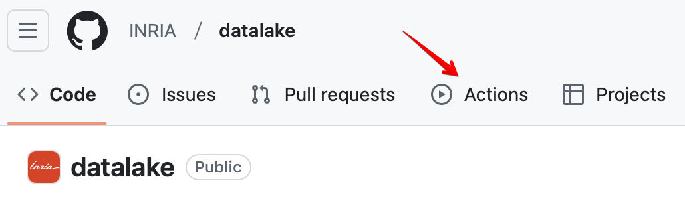
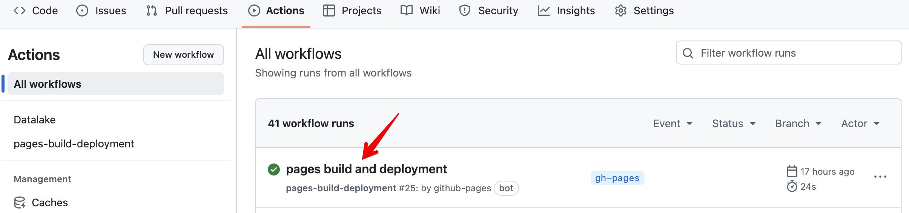
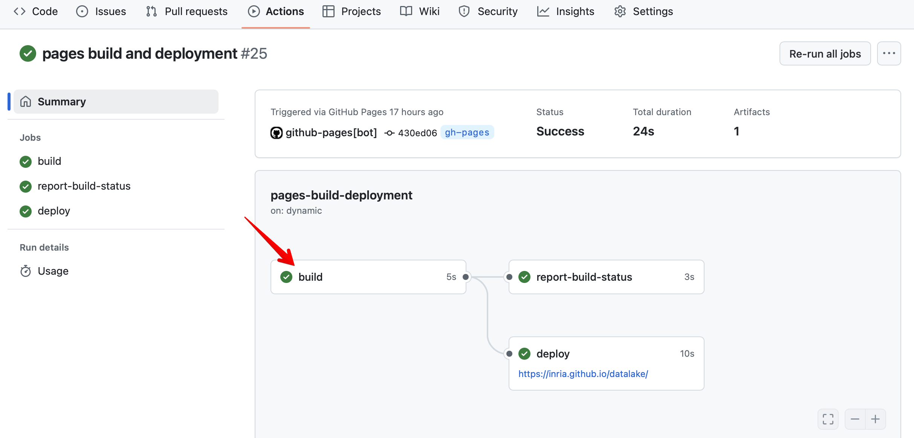
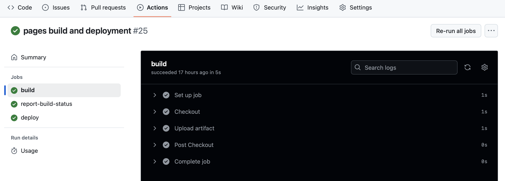

# Workflow

## Étapes de génération du portail

1. **Push vers GitHub**

    Lorsque vous effectuez un `git push` vers une branche, les fichiers
modifiés sont envoyés au dépôt distant. Cela déclenche les workflows
configurés dans GitHub Actions si des événements correspondants sont
définis (par exemple, sur `push`).

2. **Déclenchement du Workflow GitHub Actions**

    GitHub détecte le **push** et exécute le fichier de workflow
   défini dans `.github/workflows/main.yml`.

3. **Installation de l'environnement**

    Dans un projet MkDocs, les étapes incluent :

      - Vérifier le code source en le clonant. 
      - Installer Python et les dépendances requises :
        - MkDocs et ses plugins (`mkdocs-material`, etc.).
        - Toute autre bibliothèque spécifiée dans le workflow.

4. **Génération des fichiers statiques**

    Une fois l'environnement prêt, la commande `mkdocs build` est
   exécutée pour convertir les fichiers Markdown en pages HTML statiques, selon la configuration définie dans `mkdocs.yml`.

5. **Déploiement sur GitHub Pages**

    Si la branche concernée est `main`, la commande `mkdocs gh-deploy` est exécutée :

       - Elle génère et pousse les fichiers HTML vers la branche `gh-pages`.
       - GitHub Pages sert automatiquement ces fichiers comme un site web.

6. **Mise à jour du site**

    Après le déploiement sur `gh-pages`, le site hébergé sur GitHub Pages
   (par ex. `https://inria.github.io/datalake/`) est automatiquement mis à jour avec les dernières modifications.

7. **Notification et suivi**

    GitHub affiche les logs du workflow dans l'onglet **Actions**, où vous pouvez
   vérifier le succès ou l'échec des différentes étapes. En cas de problème
   (ex. : erreur de configuration), vous recevez une notification pour corriger et pousser une mise à jour.

## Debugger le workflow

{ width="500" }

{ width="500" }

{ width="500" }

{ width="500" }

&nbsp;

!!! info inline end "Texte générés en partie par ChatGPT !"

